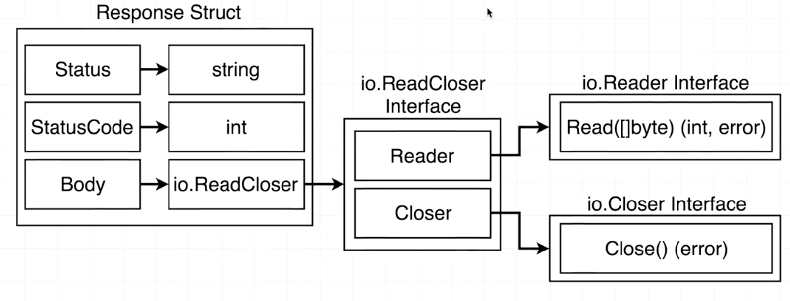
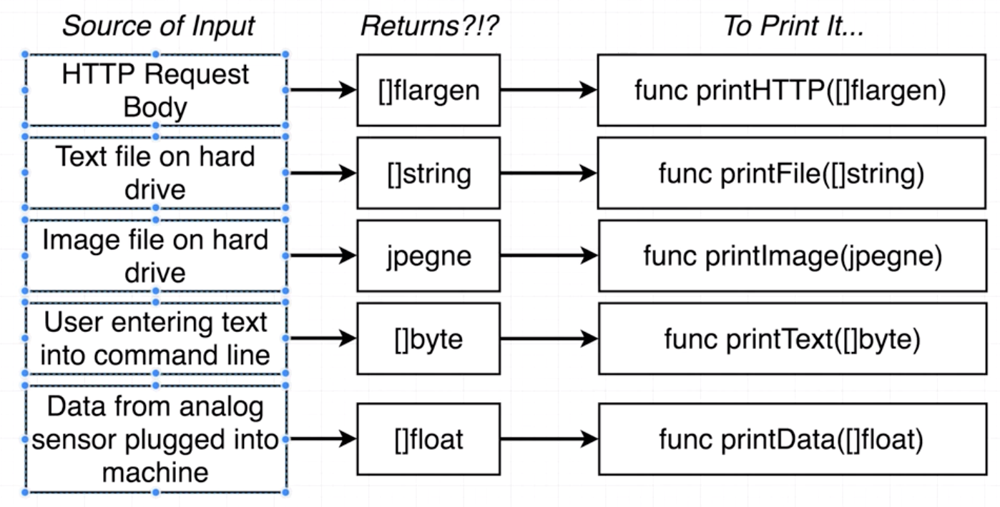
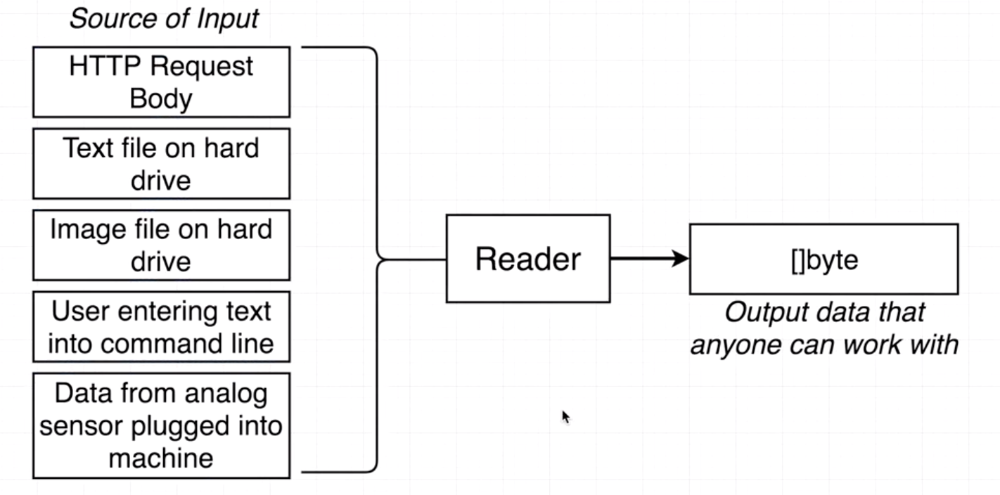
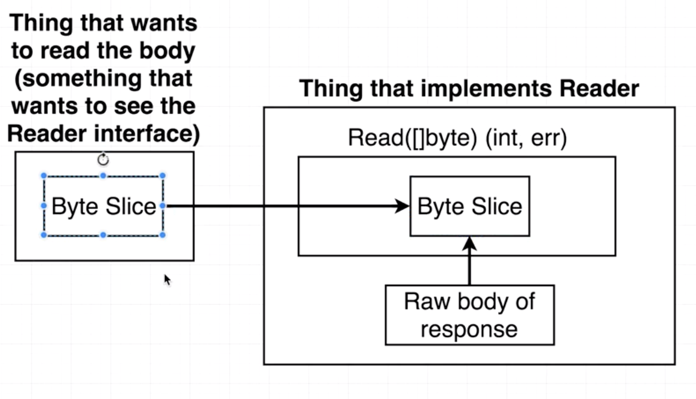
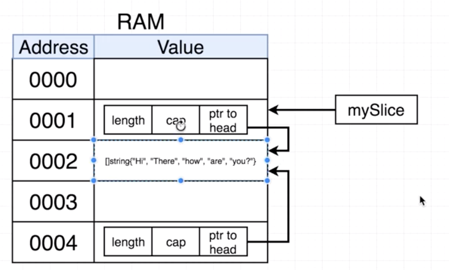

## Response Struct
The body of the Response struct has its type as an interface, that means that it can really be anything that it wants, as long as it satifies the requirements of the ReadCloser Interface

## ReadCloser Interface
In Go you can assemble different Interfaces and use them to assemble another interface
Here in the ReadCloser interface, both Reader and Closer are interfaces. Both interfaces must be satified to use the ReadCloser interface.

Now, what is a Reader Interface?

### Without the reader interface

### With the reader interface
We are using the reader interface to provide a common source of output for all these different sources on input

Remember that slices can be passed by reference, not by value. the byte slice that we pass in gets modified because both it and the Reader's byte slice refer to the original array created within the Reader.
